## Laporan Praktikum 1 : Review Dasar Pemrograman Java
**Mata Kuliah:** Praktikum Design Pattern   
**Nama:** Agus Dewangga  
**NIM:** 2024573010094  
**Kelas:** TI 2A

---

## BAB I – PENDAHULUAN

### 1.1 Latar Belakang
Sebelum melangkah ke pembahasan yang lebih kompleks seperti Design Pattern, pemahaman yang mendalam mengenai dasar-dasar pemrograman Java sangatlah krusial. Hal ini dikarenakan Design Pattern merupakan solusi standar untuk permasalahan umum dalam perancangan perangkat lunak yang sepenuhnya berbasis pada paradigma Object-Oriented Programming (OOP). Tanpa penguasaan dasar yang kuat, penerapan pola-pola tersebut akan sulit dipahami secara fungsional.


   Pada tahap awal praktikum ini, materi Design Pattern belum diberikan secara langsung. Fokus utama dialihkan pada peninjauan kembali (review) elemen-elemen fundamental Java, yang meliputi:

1. Variabel dan Tipe Data: Sebagai unit dasar penyimpanan informasi.

2. Operator: Untuk melakukan manipulasi data dan logika.

3. Struktur Kontrol: Penggunaan percabangan (if-else, switch) dan perulangan (for, while) untuk mengatur alur program.
### 1.2 Tujuan Penulisan
Tujuan laporan praktikum ini adalah:
1. Memahami Sintaks dasar pemoggraman Java
2. Mampu membuat progream sederhana menggunakan java.
3. Memahami konsep variabel, tioe data, operator, percabangan, dan perulangan.
4. Mampu menyelesaikan masalah sederhana dengan menerapakan konsep dasar pemgraman java.
---

## BAB II – PRAKTIKUM

### 2.1 Praktikum 1 – Pengenalan Java dan Lingkungan Pengembangan
#### 2.1.1 Dasar Teori
Java adalah bahasa pemrograman berorientasi objek yang populer dan banyak digunakan untuk pengembangan aplikasi desktop, web, dan mobile. Java menggunakan sintaks yang mirip dengan C++ tetapi dirancang untuk lebih mudah dipahami dan digunakan.

Untuk memulai pemrograman Java, Anda perlu:

JDK (Java Development Kit): Berisi compiler dan tools untuk mengembangkan program Java.
IDE (Integrated Development Environment): Seperti IntelliJ IDEA, Eclipse, atau NetBeans untuk menulis dan menjalankan kode.
#### 2.1.2 Langkah Praktikum
1. Pastikan JDK dan Intellij IDE Community Edition sudah terinstal.
2. Buka IDE dan buat sebuah project baru dengan ketentuan seperti berikut:
> * Name: ti_design_pattern
> * Location: disesuaikan
> * Build system: Intellij
> * JDK: Amazon Correto
> * Hilangkan centang pada bagian `add sample code`

3. Buat sebuah package baru di dalam folder src dengan cara klik kanan pada folder src kemudian pilih New -> Package. Beri nama modul_1.
4. Buat Sebuah class didalam package modul_1 dengan cara klik kanan dan pilih New -> Java Class. Beri nama HelloWorld
5. Isikan kode dibawah ini.


```java
package praktikum_1;

public class HelloWorld {
    public static void main(String[] args) {
        System.out.println("Hello, World!");
    }
}
```
6. Jalankan program.

#### 2.1.3 Screenshoot Hasil
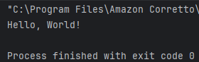


---

### 2.2 Praktikum 2 – Variabel dan Tipe Data
#### 2.2.1 Dasar Teori
Variabel digunakan untuk menyimpan data dalam program. Setiap variabel memiliki tipe data yang menentukan jenis nilai yang dapat disimpan. Tipe data dasar di Java:

1. int: Bilangan bulat (contoh: 10, -5)
2. double: Bilangan desimal (contoh: 3.14, -0.5)
3. boolean: Nilai true atau false
4. char: Karakter tunggal (contoh: 'A', '1')
5. String: Teks (contoh: "Hello")
#### 2.2.2 Langkah Praktikum
1. Buat sebuah class baru di dalam package `praktikum_1` dan beri nama `Variable`
2. Tuliskan kode berikut:
```java
package praktikum_1;

public class Variable {
    public static void main(String[] args) {
        int umur = 20;
        double tinggi = 1.99;
        boolean isMahasiswa = true;
        char JenisKelamin = 'L';
        String nama = "Budi";

        System.out.println("Nama: " + nama);
        System.out.println("Umur: "  + umur);
        System.out.println("Tinggi: "  + tinggi);
        System.out.println("Mahasiswa: "  + isMahasiswa);
        System.out.println("JenisKelamin: " + JenisKelamin);
    }
}
```
6. Jalankan program.

#### 2.2.3 Screenshoot Hasil
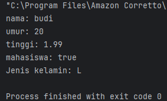

#### 2.2.4 Latihan
Buatlah program untuk menampilkan data diri anda yang lengkap dengan attribut seperti berikut:
```java
Nama Lengkap, Tempat Lahir, Tanggal Lahir, Golongan Darah, Umur,
Tinggi Badan, Jenis Kelamin, Agama, Pekerjaan.
```

#### 2.2.5 Langkah Praktikum
1. Buat sebuah class baru di dalam package `Latihan`  dan beri nama `Variable`
2. Tuliskan kode berikut:
```java
package Praktikum_1.Latihan;
import java.time.LocalDate;

public class Variable {
public static void main(String[] args){
String nama = "Agus Dewangga";
String tempatLahir = "Aceh Tengah";
LocalDate tanggalLahir = LocalDate.of(2006,8,12);
char golonganDarah = 'B';
int umur =  19;
double tinggi = 1.60;
String Agama = "Islam";
String jenisKelamin = "Laki-laki";

        System.out.println("Nama "+ nama);
        System.out.println("tempat Lahir "+ tempatLahir);
        System.out.println("Tanggal Lahir "+ tanggalLahir);
        System.out.println("Golongan Darah "+ golonganDarah);
        System.out.println("Umur "+ umur);
        System.out.println("Tinggi "+ tinggi + " cm");
        System.out.println("Jenis Kelamin "+ jenisKelamin);
    }
}
```
3. Jalankan Program.
#### 2.2.6 Screenshoot Hasil
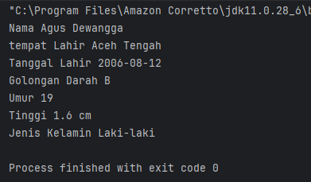

---
### 2.3 Praktikum 3 – Operator dan Expressi
#### 2.3.1 Dasar Teori
Operator digunakan untuk melakukan operasi pada variabel dan nilai. Jenis operator:

1. Aritmatika: +, -, *, /, %
2. Perbandingan: ==, !=, >, <, >=, <=
3. Logika: && (AND), || (OR), ! (NOT)
#### 2.3.2 Langkah Praktikum
1. Buat sebuah class baru di dalam package modul_1 dan beri nama Operator
2. Tuliskan kode berikut:
```java
package Praktikum_1;

public class Operator {
    public static void main(String[] args){
        int a = 10;
        int b = 20;

        System.out.println("a + b = " + (a + b ));
        System.out.println("a == b = " + (a == b ));
        System.out.println("a > b = " + (a > b ));

    }
}
```
3. Jalankan Program.
#### 2.3.3 Screenshoot Hasil
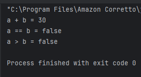

#### 2.3.4 Latihan
Buat program untuk menghitung luas persegi panjang (panjang * lebar)

#### 2.3.5 Langkah Praktikum
1. Buat sebuah class baru di dalam package `Latihan`  dan beri nama `Operator`
2. Tuliskan kode berikut:
```java
package Praktikum_1.Latihan;

public class Operator {
    public static void main(String[] args){
        int panjang = 10;
        int lebar = 5;

        System.out.println("Mencari luas persegi panjang ");
        System.out.println("panjang = "+ panjang);
        System.out.println("lebar = "+ lebar);
        System.out.println("luas Persegi panjang = " + panjang * lebar);
    }
}

```
3. Jalankan Program.
#### 2.3.6 Screenshoot Hasil
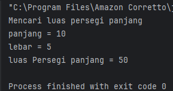

---

### 2.4 Praktikum 4 – Percabangan (If-Else dan Switch-Case)
#### 2.4.1 Dasar Teori
Percabangan digunakan untuk mengambil keputusan berdasarkan kondisi.

If-Else:
```declarative
if (kondisi) {
// Blok kode jika kondisi true
} else {
// Blok kode jika kondisi false
}
```
Switch-Case:
```declarative
switch (variabel) {
case nilai1:
// Blok kode jika variabel == nilai1
break;
case nilai2:
// Blok kode jika variabel == nilai2
break;
default:
// Blok kode jika tidak ada case yang sesuai
}
```
#### 2.4.2 Langkah Praktikum
1. Buat sebuah class baru di dalam package `Praktikum_1`  dan beri nama `Percabangan`
2. Tuliskan kode berikut:
```java
package Praktikum_1;

public class percabangan {
public static void main(String[] args){
int nilai = 95;

        if(nilai >= 80){
            System.out.println("Selamat anda lulus");
        }
        else {
            System.out.println("Anda gagal");
        }
    }
}
```
3. Jalankan Program.
---
#### 2.4.3 Screenshoot Hasil
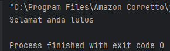
#### 2.4.4 Latihan
Buat program untuk menentukan apakah suatu bilangan genap atau ganjil.
#### 2.4.5 Langkah Praktikum
1. Buat sebuah class baru di dalam package `Latihan`  dan beri nama `Percabangan`
2. Tuliskan kode berikut:
```java
package Praktikum_1.Latihan;

public class Percabangan {
public static void main(String[] args){
int nilai = 85;

        if (nilai / 2 == 0) {
            System.out.println("Genap");
        }else{
            System.out.println("Ganjil.");
        }
    }
}
```

#### 2.4.6 Screenshoot Hasil
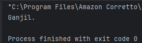

---
### 2.5 Praktikum 5 – Perulangan (For, While, Do-While)
#### 2.5.1 Dasar Teori
Perulangan digunakan untuk mengulang blok kode.
```declarative
For:

for (inisialisasi; kondisi; update) {
// Blok kode yang diulang
}
While:

while (kondisi) {
// Blok kode yang diulang
}
Do-While:


do {
// Blok kode yang diulang
} while (kondisi);
```
#### 2.5.2 Langkah Praktikum
1. Buat sebuah class baru di dalam package Praktikum_1 dan beri nama Pengulangan
2. Tuliskan kode berikut:
```java
package Praktikum_1;

public class Pengulangan {
    public static void main(String[] args){
        for (int i=1;i>=5;i++){
            System.out.println("iterasi ke- "+ i);
        }
    }
}
```
3. Jalankan program nya untuk melihat hasil.
#### 2.5.3 Screenshoot Hasil
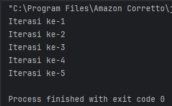
#### 2.5.4 Latihan
Buat program untuk mencetak bilangan ganjil dari 1 hingga 20. Buat 3 program dengan menggunakan for, while, do-while.
#### 2.5.5 Langkah Praktikum
1. Buat sebuah 3 class baru di dalam package Latihan dan beri nama Pengulangan_for, Pengulangan_while, Pengulangan_dowhile
2. Tuliskan kode berikut:

class Pengulangan_for
```java
package Praktikum_1.Latihan;

public class Pengulangan_for {
    public static void main(String[] args) {
        System.out.println("for");
        for (int i = 1; i <= 20; i += 2) {
            System.out.print(" " + i);
        }
    }
}

```
class Pengulangan_while
```java
package Praktikum_1.Latihan;

public class Pengulangan_while {
    public static void main(String[] args) {

        System.out.println("");
        System.out.println("while");
        int i = 1;
        while (i <= 20) {
            System.out.print(" " + i);
            i += 2;
        }
    }
}

```
class Pengulangan_dowhile
```java
package Praktikum_1.Latihan;

public class Pengulangan_dowhile {
    public static void main(String[] args){

        System.out.println("");
        System.out.println("do-while");
        int j = 1;
        do {
            System.out.print(" " + j);
            j += 2;
        }while (j <=20);
    }
}

```
3. Jalankan Program.
#### 2.5.6 Screenshoot Hasil
#### class Pengulangan_for
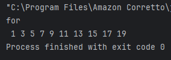
#### class Pengulangan_while
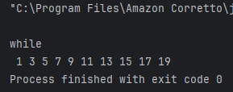
#### class Pengulangan_dowhile
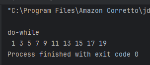
### 2.5 Praktikum 6 – Practice Problem dan Solusinya
#### 2.6.1 Dasar Teori
Practice Problem:
1. Buat program untuk menghitung faktorial dari suatu bilangan.
2. Buat program untuk mengecek apakah suatu bilangan adalah bilangan prima.
3. Buat program untuk mencetak pola segitiga menggunakan *.
#### 2.6.2 Langkah Praktikum

#### 2.6.3 Screenshoot Hasil
1. Buat sebuah class baru di dalam package `Praktikum_1`  dan beri nama `Percabangan`
2. Tuliskan kode berikut:
```java
package Praktikum_1.Latihan;

public class Faktorial {
    public static void main(String[] args){
        int n = 5;
        int hasil = 1;
        for (int i = 1; i <= n; i++){
            hasil *= i;
        }
        System.out.println("Faktorial dari "+ n +" adalah " + hasil);
    }
}

```
1. Buat sebuah class baru di dalam package `Praktikum_1`  dan beri nama `Prima`
2. Tuliskan kode berikut:
```java
package Praktikum_1.Latihan;

public class Prima {
    public static void main(String[] args){
        int n = 7;
        boolean isPrima = true;
        for (int i = 2; i <= n / 2; i++){
            if(n % i == 0){
                isPrima = false;
                break;
            }
        }
        System.out.println(n + (isPrima ? " adalah bilangan prima." : " bukan bilangan prima."));
    }
}

```
1. Buat sebuah class baru di dalam package `Praktikum_1`  dan beri nama `Segitiga`
2. Tuliskan kode berikut:
```java
package Praktikum_1.Latihan;

public class Segitiga {
    public static void main(String[] args){
        int Tinggi = 5;
        for (int i = 1; i <= Tinggi; i++){
            for (int j = 1; j <= i; j++){
                System.out.print("*");
            }
            System.out.println();
        }
    }
}

```
jalankan program untuk melihat hasil.

#### 2.6.4 Screenshoot Hasil
#### Hasil Faktorial
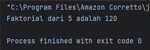
#### Hasil Class Prima
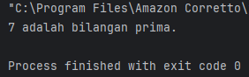
#### Hasil Class Segitiga
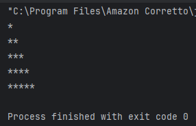
## BAB III – REFERENSI
1. Modul Praktikum 1 – Review Dasar Pemrograman Java (HackMD, Pak Muhammad Reza Zulman, S.ST., M.Sc.)

