## Laporan Praktikum 2 : Review Konsep Dasar OOP Menggunakan Java dan 4 Pillar OOP Menggunakan Java
**Mata Kuliah:** Praktikum Design Pattern   
**Nama:** Agus Dewangga  
**NIM:** 2024573010094  
**Kelas:** TI 2A

---

## BAB I – PENDAHULUAN
### 1.1 Latar Belakang
Pemrograman Berorientasi Objek (OOP) bukan sekadar teknik menulis kode, melainkan cara berpikir dalam memodelkan masalah nyata ke dalam sistem digital. Dalam konteks Design Pattern, pemahaman dasar Java sangatlah krusial. Pola desain adalah solusi umum untuk masalah yang sering muncul, dan solusi ini dibangun di atas fondasi pilar-pilar OOP. Tanpa pemahaman yang kuat tentang bagaimana Class berinteraksi atau bagaimana Abstraction bekerja, penerapan pola desain seperti Singleton, Factory, atau Observer akan sulit dilakukan secara efektif.

### 1.2 Tujuan Penulisan
Menguasai implementasi struktur dasar Java meliputi Class, Object, dan Attribute.

Memahami mekanisme keamanan data melalui Access Modifier dan Encapsulation.

Menerapkan Inheritance untuk menciptakan hierarki kode yang efisien.

Menggunakan Polymorphism untuk fleksibilitas perilaku objek melalui Method Overriding.

Mengimplementasikan Abstraction untuk menyembunyikan detail kompleksitas.

Memahami perbedaan fungsional antara hubungan Inheritance ("is-a") dan Composition ("has-a").

## BAB II – PRAKTIKUM
### 2.1 Praktikum 1  Konsep Dasar (Class & Object)
#### 2.1.1 Dasar Teori
Class: Merupakan cetakan (blueprint) yang mendefinisikan variabel (atribut) dan perilaku (method).

Object: Merupakan perwujudan nyata dari sebuah class. Setiap objek memiliki alamat memori tersendiri dan menyimpan datanya masing-masing.

#### 2.1.2 Langkah Praktikum
1. Buat sebuah package baru di dalam folder src dengan cara klik kanan pada folder src kemudian pilih New -> Package. Beri nama Praktikum_2.
2. Buat Sebuah Package Baru dengan nama bagian_1 di dalam package Praktikum_2 lalu buat class baru dengan cara klik kanan dan pilih New -> Java Class. Beri nama Mahasiswa.
3. Isikan kode dibawah ini.

```java
package Praktikum_2.bagian_1;

public class Mahasiswa {
    String nama;
    int umur;
}
```
4. buat sebuah class baru dalam package bagian_1 dengan nama main lalu isi kode berikut.
```java
package Praktikum_2.bagian_1;

public class Main {
    public static void main(String[] args) {
        Mahasiswa mhs1 = new Mahasiswa();

        mhs1.nama = "budi";
        mhs1.umur = 20;

        System.out.println("Nama: " + mhs1.nama);
        System.out.println("Umur: " + mhs1.umur);
    }
}
```
5. jalankan clas main lalu lihat hasilnya.
#### 2.1.3 Screenshoot Hasil
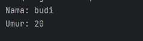
#### 2.2 Praktikum 2: Attribute dan method
#### 2.2.1 Dasar Teori
2.1.1 Atribut (State)    
Atribut adalah variabel yang didefinisikan di dalam kelas yang merepresentasikan karakteristik atau data yang dimiliki oleh sebuah objek.

Atribut sebaiknya dideklarasikan dengan akses modifier tertentu (seperti protected atau private) untuk menjaga keamanan data agar tidak diubah secara sembarangan dari luar kelas.

2.1.2 Method (Behavior)  
Method adalah kumpulan instruksi yang dibungkus dalam satu blok untuk menjalankan tugas atau perilaku tertentu dari objek.

#### 2.2.2 Langkah Praktikum
1. Buat Sebuah Package Baru dengan nama bagian_2 di dalam package Praktikum_2 lalu buat class baru nama Calculator.
2. Isikan kode dibawah ini.
```java
package Praktikum_2.bagian_2;

public class Calkulator {
int angka1;
int angka2;

    int tambah() {
        return angka1 + angka2;
    }
}
```
3. buat sebuah class baru dengan nama main dan isi dengan kode berikut.
```java   
package Praktikum_2.bagian_2;

public class Main {
public static void main(String[] args) {
Calkulator calk = new Calkulator(); // Pastikan 'C' nya kapital sesuai nama class
calk.angka1 = 5;
calk.angka2 = 10;

        // Tambahkan ini kalau mau lihat hasilnya:
        System.out.println("Hasil: " + calk.tambah());
    }
}
```
4. jalankan clas main lalu lihat hasilnya.
#### 2.2.3 Screenshoot Hasil
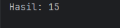

#### 2.3 Praktikum 3: Akses Modifier
#### 2.3.1 Dasar Teori
Access Modifier adalah kata kunci dalam Java yang digunakan untuk mengatur tingkat akses atau visibilitas dari sebuah class, atribut, maupun method. Berdasarkan gambar tabel visibilitas, terdapat empat tingkatan utama:

1. Public: Tingkat akses paling luas. Anggota class dapat diakses dari mana saja (Class sendiri, Package yang sama, Subclass, hingga World/Package luar).

2. Protected: Anggota class dapat diakses oleh class itu sendiri, class dalam package yang sama, dan oleh subclass (meskipun subclass berada di package berbeda).

3. Default (No Modifier): Jika tidak menuliskan kata kunci modifier, maka secara otomatis menjadi default. Hanya bisa diakses oleh class di dalam package yang sama.

4. Private: Tingkat akses paling terbatas. Anggota class hanya dapat diakses oleh class itu sendiri. Ini adalah kunci utama dalam penerapan Enkapsulasi.
#### 2.3.2 Langkah Praktikum
1. Buat Sebuah Package Baru dengan nama bagian_3 di dalam package Praktikum_2 lalu buat class baru nama AksesModifier.
2. Isikan kode dibawah ini.

```java
package Praktikum_2.bagian_3;

public class AksesModifier {
    public int publicvar = 1;
    private int privateVar = 2;
    protected int protectedVar = 3;
    int defaultVar = 4;

    public void tampilkan(){
        System.out.println("Public: " + publicvar);
        System.out.println("Private: " + privateVar);
        System.out.println("Protected: "+ protectedVar);
        System.out.println("default: "+ defaultVar);
    }
}

```
3. buat sebuah class baru dalam package bagian_1 dengan nama main lalu isi kode berikut.
```java
package Praktikum_2.bagian_3;

public class Main {
    public static void main(String[] args){
        AksesModifier contoh = new AksesModifier();
        contoh.tampilkan();
    }
}

```
4. jalankan clas main lalu lihat hasilnya.
#### 2.3.3 Screenshoot Hasil
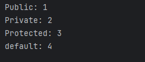
#### 2.4 Praktikum 4: Setter dan Getter
#### 2.4.1 Dasar Teori
Dalam Java, Setter dan Getter adalah dua metode publik yang digunakan untuk mengakses dan memperbarui nilai dari variabel yang dideklarasikan sebagai private.

1. Getter (Accessor): Metode yang digunakan untuk mengambil atau membaca nilai dari suatu atribut. Biasanya dimulai dengan kata get (contoh: getNama()).

2. Setter (Mutator): Metode yang digunakan untuk mengisi atau mengubah nilai dari suatu atribut. Biasanya dimulai dengan kata set (contoh: setNama(String nama)).
#### 2.4.2 Langkah Praktikum
1. Buat Sebuah Package Baru dengan nama bagian_4 di dalam package Praktikum_2 lalu buat class baru nama Mobil.
2. Isikan kode dibawah ini.

```java
package Praktikum_2.bagian_4;

public class Mobil {
    private String merk;

    public void setMerk(String merk) {
        this.merk = merk;
    }

    public String getMerk(){
        return merk;
    }
}

```
3. buat sebuah class baru dalam package bagian_1 dengan nama main lalu isi kode berikut.
```java
package Praktikum_2.bagian_4;

public class Main {
    public static void main(String[] args) {
        Mobil mobil = new Mobil();
        mobil.setMerk("Toyota");

        System.out.println("Merk Mobil: " + mobil.getMerk());
    }
}

```
4. jalankan clas main lalu lihat hasilnya.
#### 2.4.3 Screenshoot Hasil
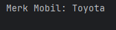
#### 2.5 Praktikum 5: Cnstructor
#### 2.5.1 Dasar Teori
Constructor adalah method khusus yang didefinisikan di dalam class dan akan dipanggil secara otomatis pada saat objek dibuat (instansiasi).

Nama constructor harus sama persis dengan nama class-nya.

Constructor tidak memiliki tipe data kembalian (return type), bahkan tidak menggunakan kata kunci void.
#### 2.5.2 Langkah Praktikum
1. Buat Sebuah Package Baru dengan nama bagian_5 di dalam package Praktikum_2 lalu buat class baru nama Person.
2. Isikan kode dibawah ini.

```java
package Praktikum_2.bagian_5;

public class Person {
    private String nama;
    private int umur;

    public Person(){
        nama = "unknown";
        umur = 0;
    }

    public Person(String nama, int umur){
        this.nama = nama;
        this.umur = umur;
    }

    public void tampilkanInfo(){
        System.out.println("Nama: " + nama);
        System.out.println("Umur: " + umur);
    }
}

```
3. buat sebuah class baru dalam package bagian_1 dengan nama main lalu isi kode berikut.
```java
package Praktikum_2.bagian_5;

public class Main {
    public static void main(String[] args) {
        Person person1 = new Person();
        Person person2 = new Person();

        person1.tampilkanInfo();
        person2.tampilkanInfo();
    }
}

```
4. jalankan clas main lalu lihat hasilnya.
#### 2.5.3 Screenshoot Hasil
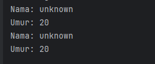

#### 2.6 Praktikum 6: Sistem Pemesanan Manajemen Perpustakaan Sederhana
#### 2.6.1 Dasar Teori
Berikut adalah contoh program konsol sederhana yang mengimplementasikan
seluruh konsep yang telah dibahas sebelumnya, yaitu class, object, attribute,
method, akses modifier, setter-getter, dan constructor. Program ini adalah
sistem manajemen perpustakaan sederhana yang memungkinkan pengguna
untuk menambahkan buku, menampilkan daftar buku, dan mencari buku
berdasarkan judul.
#### 2.6.2 Langkah Praktikum
1. Buat Sebuah Package Baru dengan nama bagian_6 di dalam package Praktikum_2 lalu buat class baru nama Perpustakaan.
2. Isikan kode dibawah ini.

```java
package Praktikum_2.bagian_6;

import java.util.ArrayList;

public class Perpustakaan {
    private ArrayList<Buku> daftarBuku;

    public Perpustakaan() {
        daftarBuku = new ArrayList<>();
    }

    public void tambahBuku(Buku buku) {
        daftarBuku.add(buku);
        System.out.println("Buku Berhasil Disimpan!");
    }

    public void tampilkanSemuaBuku() {
        if (daftarBuku.isEmpty()) {
            System.out.println("Tidak ada buku yang tersimpan.");
        } else {
            System.out.println("\n=== DAFTAR BUKU PERPUSTAKAAN ===");
            for (Buku buku : daftarBuku) {
                buku.tampilkanInfo();
            }
        }
    }

    public void cariBuku(String judul) {
        boolean ditemukan = false;
        for (Buku buku : daftarBuku) {
            if (buku.getJudul().equalsIgnoreCase(judul)) {
                System.out.println("\nBuku ditemukan!");
                buku.tampilkanInfo();
                ditemukan = true;
                break;
            }
        }
        if (!ditemukan) {
            System.out.println("Buku dengan judul \"" + judul + "\" tidak ditemukan.");
        }
    }
}

```
3. buat sebuah class baru dalam package bagian_1 dengan nama Buku lalu isi kode berikut.
```java
package Praktikum_2.bagian_6;

public class Buku {
    private String judul;
    private String pengarang;
    private int tahunTerbit;

    // Constructor Default
    public Buku() {
        this.judul = "unknown";
        this.pengarang = "unknown";
        this.tahunTerbit = 0;
    }

    // Constructor dengan Parameter
    public Buku(String judul, String pengarang, int tahunTerbit) {
        this.judul = judul;
        this.pengarang = pengarang;
        this.tahunTerbit = tahunTerbit;
    }

    // Getter dan Setter
    public void setJudul(String judul) {
        this.judul = judul;
    }

    // PERBAIKAN: Tidak pakai parameter String judul
    public String getJudul() {
        return this.judul;
    }

    public void setPengarang(String pengarang) {
        this.pengarang = pengarang;
    }

    public String getPengarang() {
        return this.pengarang;
    }

    public void setTahunTerbit(int tahunTerbit) {
        this.tahunTerbit = tahunTerbit;
    }

    public int getTahunTerbit() {
        return this.tahunTerbit;
    }

    public void tampilkanInfo() {
        System.out.println("Judul      : " + judul);
        System.out.println("Pengarang  : " + pengarang);
        System.out.println("Tahun      : " + tahunTerbit);
        System.out.println("------------------------");
    }
}
```
4. buat sebuah class baru dengan nama Main lalu isi kode berikut.
```java
package Praktikum_2.bagian_6;

import java.util.Scanner;

public class Main {
    public static void main(String[] args) {
        Scanner scanner = new Scanner(System.in);
        Perpustakaan perpustakaan = new Perpustakaan();
        int pilihan;

        do {
            System.out.println("\n=== Sistem Manajemen Perpustakaan ===");
            System.out.println("1. Tambah Buku");
            System.out.println("2. Tampilkan Semua Buku");
            System.out.println("3. Cari Buku");
            System.out.println("4. Keluar");
            System.out.print("Pilih menu: ");

            pilihan = scanner.nextInt();
            scanner.nextLine(); // Membersihkan buffer

            switch (pilihan) {
                case 1:
                    System.out.print("Masukkan judul buku: ");
                    String judul = scanner.nextLine();
                    System.out.print("Masukkan nama pengarang: ");
                    String pengarang = scanner.nextLine();
                    System.out.print("Masukkan tahun terbit: ");
                    int tahunTerbit = scanner.nextInt();
                    scanner.nextLine();

                    Buku bukuBaru = new Buku(judul, pengarang, tahunTerbit);
                    perpustakaan.tambahBuku(bukuBaru);
                    break;

                case 2:
                    perpustakaan.tampilkanSemuaBuku();
                    break;

                case 3:
                    System.out.print("Masukkan judul buku yang ingin dicari: ");
                    String judulCari = scanner.nextLine();
                    perpustakaan.cariBuku(judulCari);
                    break;

                case 4:
                    System.out.println("Terima kasih! Keluar dari program...");
                    break;

                default:
                    System.out.println("Pilihan tidak valid, silakan coba lagi.");
            }
        } while (pilihan != 4);

        scanner.close();
    }
}
```
5. jalankan clas main lalu lihat hasilnya.
#### 2.6.3 Screenshoot Hasil
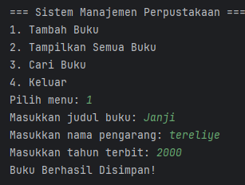
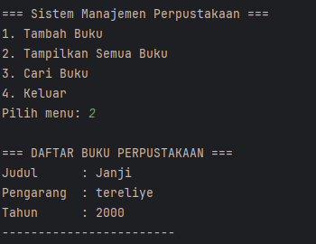

#### 2.7 Praktikum 7: Pengenalan OOP dan Class-Object
#### 2.7.1 Dasar Teori
OOP (Object-Oriented Programming) adalah paradigma pemrograman yang
menggunakan "objek" untuk merepresentasikan data dan metode yang
beroperasi pada data tersebut. Konsep dasar OOP:
1. Class: Blueprint atau template untuk membuat objek.
2. Object: Instance dari class yang memiliki atribut dan metode.
#### 2.7.2 Langkah Praktikum
1. Buat sebuah package baru di dalam folder src dengan cara klik kanan pada folder src kemudian pilih New -> Package. Beri nama Praktikum_3.
2. Buat Sebuah Package Baru dengan nama bagian_7 di dalam package Praktikum_3 lalu buat class baru nama Mahasiswa.
3. Isikan kode dibawah ini.

```java
package praktikum_3.bagian_1;

public class Mahasiswa {
    String nama;
    int umur;

    void displayInfo() {
        System.out.println("Nama: " + nama);
        System.out.println("Umur: " + umur);
    }
}

```
4. buat sebuah class baru dalam package bagian_1 dengan nama main lalu isi kode berikut.
```java
package praktikum_3.bagian_1;

public class Main {
    public static void main(String[] args) {
        praktikum_3.bagian_1.Mahasiswa mhs1 = new praktikum_3.bagian_1.Mahasiswa();
        mhs1.nama = "Budi";
        mhs1.umur = 20;

        mhs1.displayInfo();
    }
}

```
5. jalankan clas main lalu lihat hasilnya.
#### 2.7.3 Screenshoot Hasil
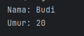

#### 2.8 Praktikum 8: Encapsulation
#### 2.8.1 Dasar Teori
Encapsulation adalah konsep menyembunyikan detail internal objek dan hanya
mengekspos fungsionalitas yang diperlukan. Ini dilakukan dengan
menggunakan access modifier (private, public, protected) dan getter-setter
#### 2.8.2 Langkah Praktikum
1. Buat Sebuah Package Baru dengan nama bagian_8 di dalam package Praktikum_3 lalu buat class baru nama Mahasiswa.
2. Isikan kode dibawah ini.

```java
package modul_3.bagian_2;

import java.security.SecureRandom;

public class Mahasiswa {
    private String nama;
    private int umur;

    public String getNama() {
        return nama;
    }

    public void setNama(String nama){
        this.nama = nama;
    }

    public int getUmur(){
        return umur;
    }

    public void setUmur(int umur) {
        this.umur = umur;
    }
}

```
3. buat sebuah class baru dalam package bagian_1 dengan nama main lalu isi kode berikut.
```java
package praktikum_3.bagian_1;

public class Main {
    public static void main(String[] args) {
        praktikum_3.bagian_1.Mahasiswa mhs1 = new praktikum_3.bagian_1.Mahasiswa();
        mhs1.nama = "Budi";
        mhs1.umur = 20;

        mhs1.displayInfo();
    }
}

```
4. jalankan clas main lalu lihat hasilnya.
#### 2.8.3 Screenshoot Hasil


#### 2.9 Praktikum 8: Inheritance (Pewarisan) dan Composition (Komposisi)
#### 2.9.1 Dasar Teori
Dalam pemrograman berorientasi objek (OOP), Inheritance dan Composition
adalah dua konsep penting yang digunakan untuk membangun hubungan
antara class. Meskipun keduanya memiliki tujuan yang sama, yaitu
mempromosikan reuseability (penggunaan kembali kode) dan modularitas,
mereka memiliki pendekatan yang berbeda. Berikut adalah penjelasan lengkap
tentang Composition dan perbandingannya dengan Inheritance.
1. Inheritance (Pewarisan)
Inheritance adalah mekanisme di mana sebuah class (subclass/child class)
mewarisi atribut dan metode dari class lain (superclass/parent class).
Inheritance menggambarkan hubungan "is-a" (adalah). Misalnya, Kucing
adalah Hewan.   

Ciri-Ciri Inheritance:   
   Menggunakan keyword extends.
   Subclass mewarisi semua atribut dan metode dari superclass (kecuali
   yang private).
   Subclass dapat menambahkan atribut dan metode baru, atau mengoverride metode yang ada.
   Mendukung hierarki class (class dapat mewarisi dari satu superclass).

#### 2.9.2 Langkah Praktikum
1. Buat package baru di dalam bagian_3 dan beri nama pewarisan
2. Kemudian buat sebuah class baru dengan nama Kendaraan dan isikan
   kode berikut:

```java
package praktikum_3.bagian_3.pewarisan;

public class Kendaraan {
    String merk;
    int tahun;

    void displayInfo()  {
        System.out.println("Merk :" + merk);
        System.out.println("Tahun :" + tahun);
    }
}

```
3. Kemudian buat sebuah class baru dengan nama Mobil dan isikan kode
   berikut:
```java
package praktikum_3.bagian_3.pewarisan;

public class Mobil extends Kendaraan{
    int jumlahPintu;

    void displayInfoMobil() {
        displayInfo();
        System.out.println("Jumlah Pintu:" + jumlahPintu);
    }
}


```
4. Kemudian buat sebuah class baru dengan nama Main dan isikan kode
   berikut:
```java
package praktikum_3.bagian_3.pewarisan;

public class Main {
public static void main(String[] args) {
Mobil mbl1 = new Mobil();
mbl1.merk = "Toyota";
mbl1.tahun = 2021;
mbl1.jumlahPintu = 4;

        mbl1.displayInfoMobil();
    }
}
```
#### 2.9.3 Screenshoot Hasil
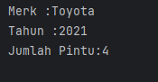

#### 2.10 Praktikum 9: Polymorphism (Polimorfisme)
#### 2.10.1 Dasar Teori
Polymorphism memungkinkan objek untuk memiliki banyak bentuk. Ini dapat
dicapai melalui method overriding (mengganti metode di subclass) dan
method overloading (beberapa metode dengan nama sama tetapi parameter
berbeda).

Method Overriding   
Method overriding terjadi ketika subclass (class anak) menyediakan
implementasi spesifik untuk method yang sudah didefinisikan di superclass
(class induk). Method overriding digunakan untuk mengubah atau memperluas
perilaku method yang diwarisi dari superclass. Method yang di-override harus
memiliki nama, parameter, dan return type yang sama dengan method di
superclass.

Aturan Method Overriding:
1. Method harus memiliki nama dan parameter yang sama dengan method di
superclass.
2. Return type harus sama atau subtype dari return type di superclass.
3. Access modifier tidak boleh lebih restriktif daripada method di superclass
(misalnya, jika method di superclass protected, method di subclass bisa
protected atau public).
4. Method tidak bisa di-override jika di superclass dideklarasikan sebagai
final.


#### 2.10.2 Langkah Praktikum
1. Buat Sebuah package baru lagi didalam package modul_3 dengan cara klik
   kanan dan pilih New -> Package . Beri nama bagian_4
2. Kemudian buat sebuah package baru di dalam bagian_4 dan beri nama
   overriding
3. Kemudian buat sebuah class baru dengan nama Hewan dan isikan kode
   berikut:
```java
package modul_3.bagian_4.overriding;

public class Hewan {
    void bersuara(){
        System.out.println("Hewan bersuara. ");
    }
}

```
4. Kemudian buat sebuah class baru dengan nama Kucing dan isikan kode
   berikut:
```java
package modul_3.bagian_4.overriding;

class Kucing extends Hewan {
    @Override
    void bersuara(){
        System.out.println("Meong. ");
    }

}
```
5. Kemudian buat sebuah class baru dengan nama Anjing dan isikan kode
   berikut:
```java
package modul_3.bagian_4.overriding;

class Anjing extends Hewan {
    @Override
    void bersuara(){
        System.out.println("Guk Guk. ");
    }

}

```
6. Kemudian buat sebuah class baru dengan nama Main dan isikan kode
   berikut:
```java
package modul_3.bagian_4.overriding;

public class Main {
    public static void  main (String[] args){
        Hewan hewan1 = new Kucing();
        Hewan hewan2 = new Anjing();

        hewan1.bersuara();
        hewan2.bersuara();
    }
}

```
#### 2.10.3 Screenshoot Hasil
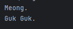
#### 2.11 Praktikum 10: Abstraction (Abstraksi) | Abstract Class dan Interface
#### 2.11.1 Dasar Teori
Pada konsep OOP (Object-Oriented Programming), Abstraction adalah salah
satu dari empat pilar utama (bersama Encapsulation, Inheritance, dan
Polymorphism). Abstraction memungkinkan kita untuk menyembunyikan detail
implementasi dan hanya menampilkan fungsionalitas yang diperlukan kepada
pengguna. Di Java, abstraction dapat diimplementasikan menggunakan
Abstract Class dan Interface.

Abstract Class   
Abstract class adalah class yang tidak dapat diinstansiasi (tidak bisa dibuat
objeknya langsung). Abstract class dapat memiliki method abstrak (tanpa
implementasi) dan method konkret (dengan implementasi). Abstract class
digunakan ketika kita ingin membuat blueprint untuk class-class lain yang
memiliki perilaku serupa tetapi dengan implementasi yang berbeda.

Ciri-Ciri Abstract Class:     
1. Dideklarasikan dengan keyword abstract.
2. Dapat memiliki atribut, method konkret, dan method abstrak.
3. Method abstrak tidak memiliki body (hanya deklarasi).
4. Subclass yang mewarisi abstract class harus mengimplementasikan
5. semua method abstrak (kecuali subclass tersebut juga abstract).
#### 2.11.2 Langkah Praktikum
1. Buat Sebuah package baru lagi didalam package modul_3 dengan cara klik
   kanan dan pilih New -> Package . Beri nama bagian_5
2. Buat sebuah package baru di dalam bagian_5 dan beri nama abstrak .
3. Kemudian buat sebuah class baru di dalam abtrak dengan nama Hewan
   dan isikan kode berikut:
```java
package modul_3.bagian_5.abstrak;

abstract class Hewan {
    // Atribut
    String nama;

    // Method konkret
    void makan() {
        System.out.println(nama + " sedang makan.");
    }

    // Method abstrak
    abstract void bersuara();
}

```
4. Kemudian buat sebuah class baru di dalam abtrak dengan nama Kucing
   dan isikan kode berikut:
```java
package modul_3.bagian_5.abstrak;

// Subclass dari abstract class
class Kucing extends Hewan {
    @Override
    void bersuara() {
        System.out.println("Meong!");
    }
}
```
5. Kemudian buat sebuah class baru di dalam abtrak dengan nama Anjing
   dan isikan kode berikut:
```java
   package modul_3.bagian_5.abstrak;

class Anjing extends Hewan {
@Override
void bersuara() {
System.out.println("Guk Guk!");
}
}
```
6. Kemudian buat sebuah class baru dengan nama Main dan isikan kode
   berikut:
```java
package modul_3.bagian_5.abstrak;


public class Main {
    public static void main(String[] args) {
        Hewan kucing = new Kucing();
        kucing.nama = "Kitty";
        kucing.makan();      // Method konkret dari abstract class
        kucing.bersuara();   // Method abstrak yang di-override

        Hewan anjing = new Anjing();
        anjing.nama = "Doggy";
        anjing.makan();      // Method konkret dari abstract class
        anjing.bersuara();   // Method abstrak yang di-override
    }
}

```

#### 2.11.3 Screenshoot Hasil
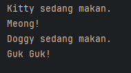

#### 2.12 Praktikum 10: Aplikasi Console Pemesanan Tiket Sederhana
#### 2.12.1 Dasar Teori
Berikut adalah contoh aplikasi console pemesanan tiket untuk sebuah
konferensi yang mengimplementasikan seluruh konsep OOP (Class, Object,
Encapsulation, Inheritance, Polymorphism, dan Abstraction). Aplikasi ini
memiliki fitur lengkap seperti:
1. Menampilkan daftar tiket yang tersedia.
2. Memesan tiket.
3. Melihat detail pesanan.
4. Membatalkan pesanan.
5. Menghitung total harga.
6. Menerapkan diskon berdasarkan jenis tiket.

#### 2.11.2 Langkah Praktikum
1. Buat Sebuah package baru lagi didalam package modul_3 dengan cara klik
   kanan dan pilih New -> Package . Beri nama bagian_6
2. Kemudian buat sebuah class baru dengan nama Tiket dan isikan kode
   berikut:
```java
package modul_3.bagian_6;

abstract class Tiket {
    private final String jenis;
    private final double harga;

    public Tiket(String jenis, double harga) {
        this.jenis = jenis;
        this.harga = harga;
    }

    public String getJenis() {
        return jenis;
    }

    public double getHarga() {
        return harga;
    }

    // Abstract method untuk menghitung diskon
    public abstract double hitungDiskon();
}

```
3. Kemudian buat sebuah class baru dengan nama tiketreguler dan isikan kode Berikut:
```java
package modul_3.bagian_6;

class TiketReguler extends Tiket {
    public TiketReguler() {
        super("Reguler", 100000); // Harga tiket reguler
    }

    @Override
    public double hitungDiskon() {
        return 0; // Tidak ada diskon untuk tiket reguler
    }
}

```
4. Kemudian buat sebuah class baru dengan nama TiketVIP dan isikan kode
   berikut:
```java
package modul_3.bagian_6;

class TiketVIP extends Tiket {
    public TiketVIP() {
        super("VIP", 250000); // Harga tiket VIP
    }

    @Override
    public double hitungDiskon() {
        return 0.1 * getHarga(); // Diskon 10% untuk tiket VIP
    }
}

```
5. Kemudian buat sebuah class baru dengan nama Pesanan dan isikan kode
   berikut:
```java
package modul_3.bagian_6;

class Pesanan {
    private final String namaPemesan;
    private final Tiket tiket;
    private final int jumlah;

    public Pesanan(String namaPemesan, Tiket tiket, int jumlah) {
        this.namaPemesan = namaPemesan;
        this.tiket = tiket;
        this.jumlah = jumlah;
    }

    public String getNamaPemesan() {
        return namaPemesan;
    }

    public Tiket getTiket() {
        return tiket;
    }

    public int getJumlah() {
        return jumlah;
    }

    // Menghitung total harga setelah diskon
    public double hitungTotal() {
        double total = tiket.getHarga() * jumlah;
        double diskon = tiket.hitungDiskon() * jumlah;
        return total - diskon;
    }

    // Menampilkan detail pesanan
    public void displayDetail() {
        System.out.println("\nDetail Pesanan:");
        System.out.println("Nama Pemesan: " + namaPemesan);
        System.out.println("Jenis Tiket: " + tiket.getJenis());
        System.out.println("Jumlah: " + jumlah);
        System.out.println("Total Harga: Rp" + hitungTotal());
    }
}

```
6. Kemudian buat sebuah class baru dengan nama konferensiApp dan isikan kode berikut:
```java
package modul_3.bagian_6;

import java.util.ArrayList;
import java.util.Scanner;

public class KonferensiApp {
    private static final ArrayList<Pesanan> daftarPesanan = new ArrayList<>();
    private static final Scanner scanner = new Scanner(System.in);

    public static void main(String[] args) {
        while (true) {
            System.out.println("\n=== Aplikasi Pemesanan Tiket Konferensi ===");
            System.out.println("1. Lihat Daftar Tiket");
            System.out.println("2. Pesan Tiket");
            System.out.println("3. Lihat Detail Pesanan");
            System.out.println("4. Batalkan Pesanan");
            System.out.println("5. Keluar");
            System.out.print("Pilih menu: ");

            int pilihan = scanner.nextInt();
            scanner.nextLine(); // Membersihkan newline

            switch (pilihan) {
                case 1:
                    lihatDaftarTiket();
                    break;
                case 2:
                    pesanTiket();
                    break;
                case 3:
                    lihatDetailPesanan();
                    break;
                case 4:
                    batalkanPesanan();
                    break;
                case 5:
                    System.out.println("Terima kasih telah menggunakan aplikasi ini.");
                    System.exit(0);
                default:
                    System.out.println("Pilihan tidak valid. Silakan coba lagi.");
            }
        }
    }

    // Method untuk menampilkan daftar tiket
    private static void lihatDaftarTiket() {
        System.out.println("\nDaftar Tiket:");
        System.out.println("1. Tiket Reguler - Rp100.000");
        System.out.println("2. Tiket VIP - Rp250.000 (Diskon 10%)");
    }

    // Method untuk memesan tiket
    private static void pesanTiket() {
        System.out.print("\nMasukkan nama pemesan: ");
        String namaPemesan = scanner.nextLine();

        System.out.print("Pilih jenis tiket (1: Reguler, 2: VIP): ");
        int jenisTiket = scanner.nextInt();
        System.out.print("Masukkan jumlah tiket: ");
        int jumlah = scanner.nextInt();

        Tiket tiket = null;
        switch (jenisTiket) {
            case 1:
                tiket = new TiketReguler();
                break;
            case 2:
                tiket = new TiketVIP();
                break;
            default:
                System.out.println("Jenis tiket tidak valid.");
                return;
        }

        Pesanan pesanan = new Pesanan(namaPemesan, tiket, jumlah);
        daftarPesanan.add(pesanan);
        System.out.println("Pesanan berhasil dibuat!");
        pesanan.displayDetail();
    }

    // Method untuk melihat detail pesanan
    private static void lihatDetailPesanan() {
        if (isNoPesanan()) return;

        System.out.print("Pilih nomor pesanan untuk melihat detail: ");
        int nomorPesanan = scanner.nextInt();

        if (nomorPesanan > 0 && nomorPesanan <= daftarPesanan.size()) {
            daftarPesanan.get(nomorPesanan - 1).displayDetail();
        } else {
            System.out.println("Nomor pesanan tidak valid.");
        }
    }

    private static boolean isNoPesanan() {
        if (daftarPesanan.isEmpty()) {
            System.out.println("\nBelum ada pesanan.");
            return true;
        }

        System.out.println("\nDaftar Pesanan:");
        for (int i = 0; i < daftarPesanan.size(); i++) {
            System.out.println((i + 1) + ". " + daftarPesanan.get(i).getNamaPemesan());
        }
        return false;
    }

    // Method untuk membatalkan pesanan
    private static void batalkanPesanan() {
        if (isNoPesanan()) return;

        System.out.print("Pilih nomor pesanan yang ingin dibatalkan: ");
        int nomorPesanan = scanner.nextInt();

        if (nomorPesanan > 0 && nomorPesanan <= daftarPesanan.size()) {
            daftarPesanan.remove(nomorPesanan - 1);
            System.out.println("Pesanan berhasil dibatalkan.");
        } else {
            System.out.println("Nomor pesanan tidak valid.");
        }
    }
}
```

#### 2.11.3 Screenshoot Hasil
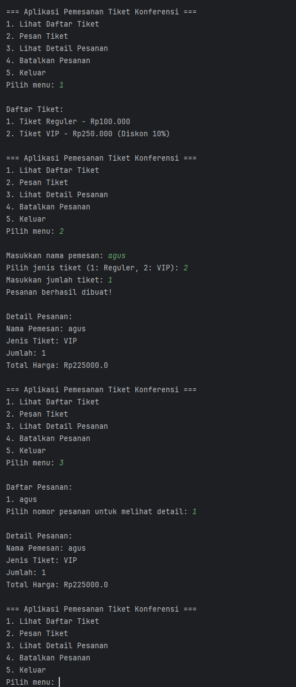

### BAB III – REFERENSI

Bloch, Joshua. (2018). Effective Java (3rd Edition). Addison-Wesley Professional.

Oracle. Java Documentation: Object-Oriented Programming Concepts.